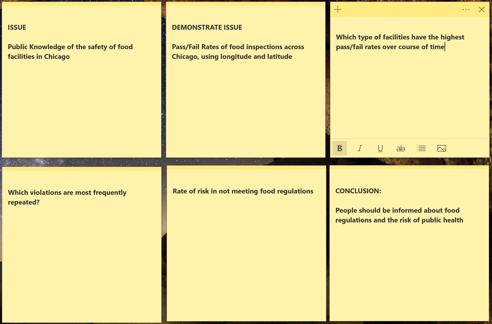
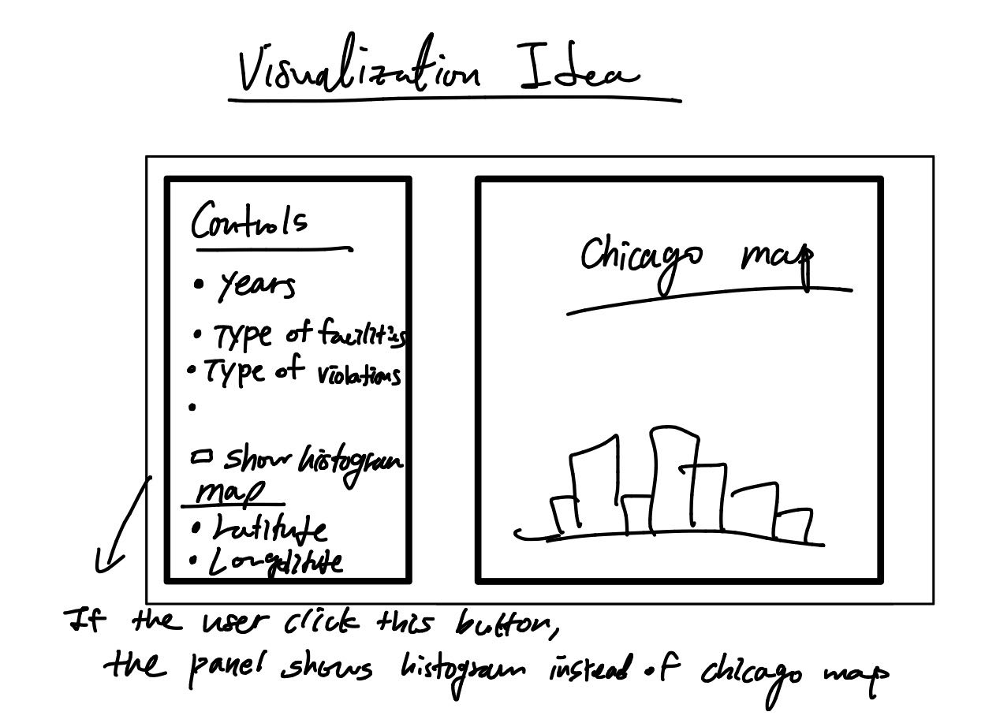

#### Tentative Title: 
Public Safety of Food in Chicago Area

#### Dataset: 
Chicago Food Inspections

#### Summary:

Goal: Demonstrate the current state of public food safety as well as its change in the Chicago area over time.
The project will address three main topics on the risk of public food safety:

1. How widespread are failed inspections?
2. What might be the main cause?
3. How has it changed over time/current state?

To answer these three questions the project will consist of the following respectively:

1. The results of food inspections performed by the Chicago Department of Public Health’s Food Protection Program across the map of Chicago
2. The prevalence of each perspective regulation violated by facilities
3. The rate of failing inspections and rate of high risk of the endangerment of public health across time

